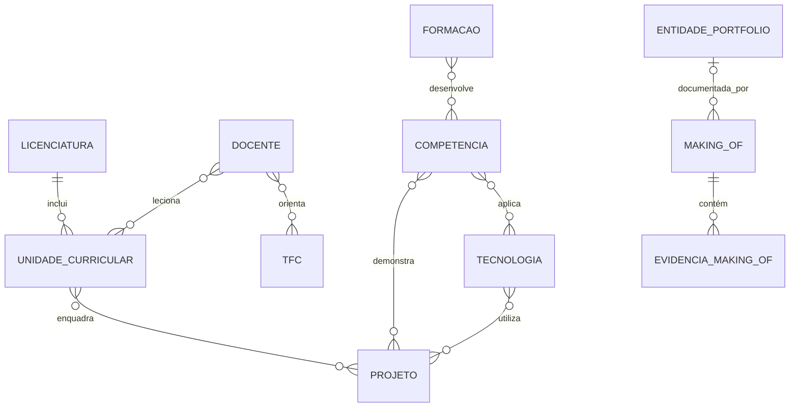

# Making Of — Ficha 6

## Estado e limite do trabalho

Esta versão cobre a modelação e a configuração do Django Admin até ao final da
secção 3. Não inclui páginas públicas, dados fictícios persistentes, importação
do JSON de TFCs, APIs ou scraping. A modelação será revista quando forem
observados os dados reais das secções seguintes.

## Evolução do modelo

### Versão 1 — identificação das entidades

Foram identificadas as entidades pedidas: Licenciatura, Unidade Curricular,
Projeto, Tecnologia, TFC, Competência, Formação e Making Of.

### Versão 2 — normalização das relações

Foi criada `Docente` como entidade adicional. Um docente pode participar em
várias UCs e orientar vários TFCs, evitando repetir nome, contacto e página
pessoal. As fotografias do processo foram separadas em `EvidenciaMakingOf`,
permitindo várias imagens ordenadas por entrada do diário.

### Versão 3 — implementação incremental

Os modelos foram implementados em três migrações: núcleo académico; projetos e
percurso pessoal; diário Making Of. A separação permite reconhecer a evolução
da base de dados e localizar mais facilmente uma futura alteração.

## Diagrama entidade-relação digital

Este diagrama é um apoio à passagem do modelo para papel. Não substitui a
fotografia obrigatória do DER desenhado pelo aluno.

`ENTIDADE_PORTFOLIO` representa conceptualmente qualquer um dos modelos da
aplicação. Em Django, esta ligação é implementada com `ContentType` e um ID, o
que permite documentar entidades diferentes sem criar uma coluna opcional para
cada uma.

## Decisões e justificações por entidade

### Licenciatura

1. O código institucional é único, porque será a referência estável usada pela
   futura API; para LEI está preparado o código `260`.
2. Duração e ECTS são valores separados da descrição para poderem ser filtrados
   e validados, em vez de ficarem escondidos em texto livre.

### Docente — entidade adicional

1. Foi criada uma entidade própria porque o mesmo docente pode lecionar várias
   UCs e orientar vários TFCs.
2. A página pessoal é obrigatória, pois a ficha pede explicitamente a ligação
   ao perfil da Universidade Lusófona; email e fotografia são opcionais.

### Unidade Curricular

1. Cada UC pertence a uma licenciatura, mas pode ter vários docentes, pelo que
   foram usadas relações `ForeignKey` e `ManyToManyField`, respetivamente.
2. Código, ano, semestre e ECTS são estruturados para permitirem pesquisa e
   filtros no Admin; a imagem é obrigatória por requisito do enunciado.

### Projeto

1. A relação com UCs é muitos-para-muitos porque um projeto pode combinar
   conhecimentos de mais de uma disciplina.
2. GitHub é obrigatório por ser importante para entrevistas; demo e vídeo são
   opcionais porque nem todos os projetos possuem esses recursos.

### Tecnologia

1. Categoria e nível usam escolhas fechadas para evitar variações como
   “framework”, “Framework” e “framework web” nos filtros.
2. O interesse usa uma escala validada de 1 a 5; logo e website oficial são
   obrigatórios para caracterizar visualmente e referenciar a tecnologia.

### TFC

1. O título, resumo, ano, estudante e área foram escolhidos como núcleo inicial,
   sem tentar antecipar todas as propriedades do JSON ainda não analisado.
2. Orientadores são relacionados com `Docente`; interesse e destaque registam
   a avaliação pessoal pedida sem alterar os dados objetivos do TFC.

### Competência

1. Categoria e nível refletem a forma habitual de organizar competências num
   CV e permitem filtros consistentes.
2. As relações com projetos e tecnologias funcionam como evidência concreta de
   onde cada competência foi aplicada.

### Formação

1. Datas de início e fim permitem ordenação cronológica; `em_curso` representa
   formações ainda sem data final.
2. Certificado e URL são opcionais porque nem todas as formações fornecem ambos;
   competências relacionam a formação com resultados adquiridos.

### Making Of

1. Decisões, erros, correções e uso de IA possuem campos separados para que o
   processo não fique reduzido a uma descrição genérica.
2. Foi usada uma relação genérica validada, permitindo associar uma entrada a
   qualquer entidade do portfólio sem dezenas de relações opcionais.

### Evidência Making Of

1. A evidência é um modelo separado para permitir várias fotografias em cada
   entrada do diário.
2. Legenda e ordem são obrigatórias; a combinação entrada/ordem é única para
   manter uma sequência inequívoca.

## Problemas identificados e correções

- O projeto Django gera um ficheiro `views.py`, mas esta fase é exclusivamente
  administrativa. O ficheiro foi removido e só existe a rota `/admin/`.
- A configuração inicial gera uma chave secreta dentro de `settings.py`. Foi
  substituída por leitura de variável de ambiente, com valor local não secreto.
- Uma data final de formação poderia ser anterior à data inicial. Foi adicionada
  validação no modelo para impedir esse estado.
- Uma ligação genérica do Making Of poderia guardar apenas o tipo, apenas o ID
  ou um ID inexistente. A validação exige o par completo e confirma a existência
  do objeto.

## Utilização de inteligência artificial

Foi utilizado o Codex como apoio para interpretar o enunciado, propor a primeira
modelação, implementar os modelos e o Admin e preparar a documentação.
As decisões continuam a ter de ser revistas e explicadas pelo aluno durante a
defesa. A IA não consultou nem inventou dados pessoais, TFCs ou conteúdos das
APIs, e não produziu fotografias falsas de trabalho em papel.

## Evidências em papel ainda necessárias

Antes da submissão, desenhar e fotografar:

1. Lista inicial de entidades e atributos.
2. Primeira versão do DER.
3. Versão revista com `Docente`, relações muitos-para-muitos e Making Of.
4. Apontamentos sobre pelo menos uma alteração ou correção feita pelo aluno.

Guardar os ficheiros reais em `media/makingof/` seguindo o guia dessa pasta e
substituir esta secção por referências às fotografias adicionadas.
